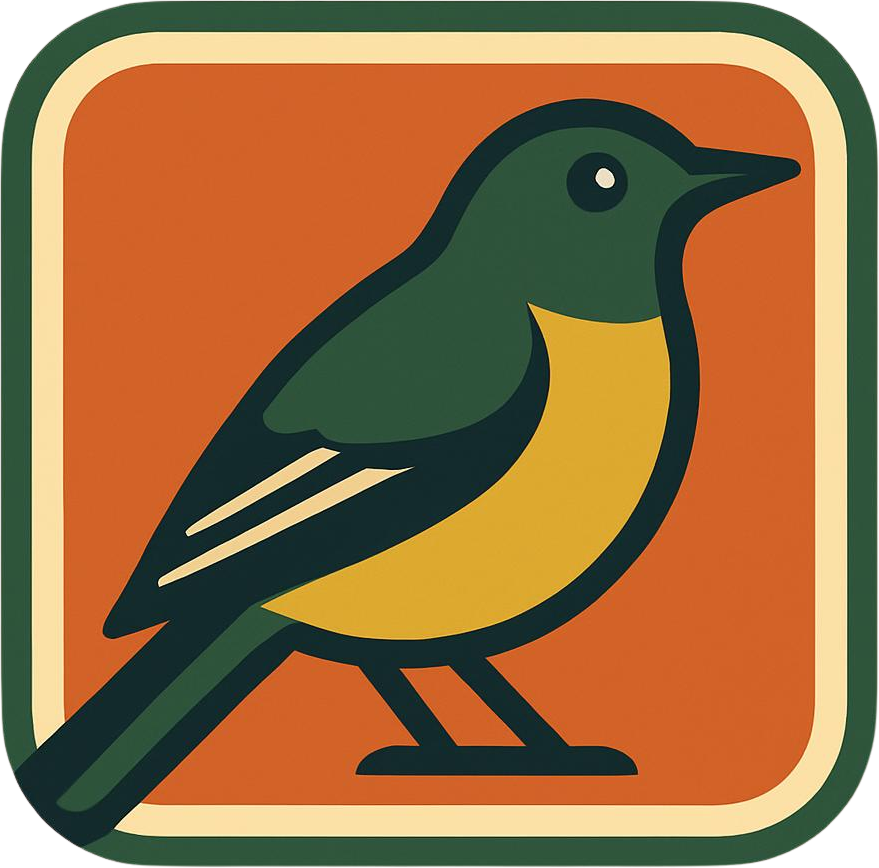
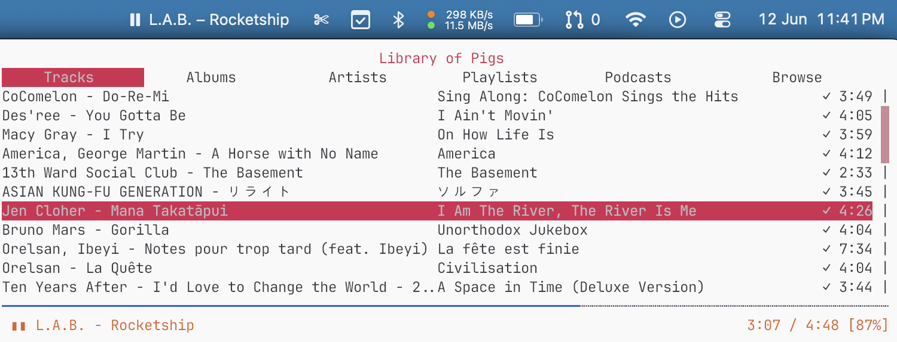
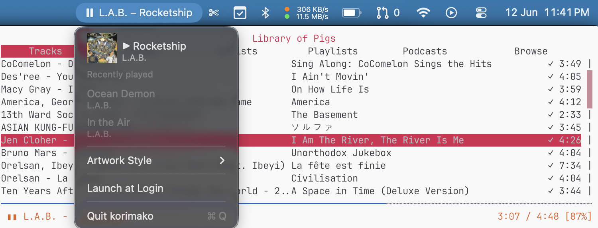
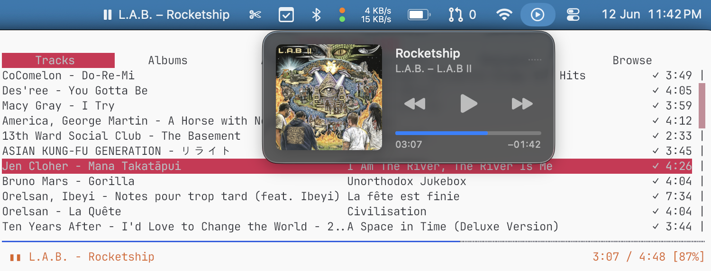

<div align="center">
  <br><br>
  <h1>korimako</h1>
  <p>Hardware media keys → <a href="https://github.com/hrkfdn/ncspot">ncspot</a>, via macOS Now Playing</p>
  
  
  
  
</div>

<br>

*Korimako* is the te reo Māori name for the New Zealand bellbird, named for its clear, bell-like song. They have also been known to reproduce some sounds such as ringtones. Similarly, this app listens for media key presses and sings them across to `ncspot`.

## Features

**Your keyboard media keys — ⏮ ⏯ ⏭ — now control ncspot.** korimako registers
as a Now Playing source so it wins key ownership over browsers and other apps.
Pause ncspot and the keys hand back automatically, just like Spotify or Music would.

Your current track is always visible in the menubar, and the menu keeps a short
history of what you've been listening to with styled album art.



The full menu shows the current track with album art, your two most recent tracks,
and a style picker that applies Core Image effects to album art live.



korimako also hooks into the macOS Control Center media widget — including the
position scrubber, so you can seek to any point in the track from there.



## How it works

```
 media key  ──▶  MPRemoteCommandCenter  ──▶  korimako  ──▶  ncspot.sock
 (play/pause)                                    │           (playpause/next/previous/seek)
                                                 ▼
 menubar + Control Center  ◀──  MPNowPlayingInfoCenter  ◀──  JSON status stream
```

- **Media keys** are claimed via the public `MPRemoteCommandCenter` — enough to
  win ownership over browsers on macOS 13–26, and it preserves natural now-playing
  handoff (pause ncspot and your browser gets the keys back, just like Spotify).
- **IPC** uses ncspot's Unix domain socket (`USER_RUNTIME_PATH/ncspot.sock`,
  discovered via `ncspot info`, with a `/tmp/ncspot-$UID` fallback). Status frames
  are newline-delimited JSON; commands are plain text tokens.
- **Scrubber** — the Control Center position scrubber maps to ncspot's `seek`
  command, so you can drag to any point in the current track.
- **Resilience** — auto-reconnects when ncspot starts/stops; relinquishes Now
  Playing when ncspot isn't running so keys fall back to other apps.

## Requirements

- macOS 13+ (Apple Silicon or Intel)
- Swift Command Line Tools — **no Xcode required** (`xcode-select --install`)
- `ncspot` with IPC (Homebrew's build includes it)

## Install

```sh
git clone https://github.com/gouegd/korimako
cd korimako
./scripts/build-app.sh          # produces korimako.app (ad-hoc signed)
cp -R korimako.app /Applications/
open /Applications/korimako.app
```

The menubar icon appears; there is no Dock icon. Enable **Launch at Login**
from the menubar menu for automatic start on login.

## Menu

| Item | Detail |
|------|--------|
| **▶ Current track** | Styled album art · artist – title · click to play/pause |
| Recently played | Last two tracks (title + artist); informational |
| **Artwork Style** | Core Image effect applied to album art — Original, Cartoon, Comic, Poster, Ink Sketch, Noir, Sepia, Pixel, Thermal, Neon Edges. Persists across launches. |
| **Launch at Login** | Toggle via `SMAppService` (works best from `/Applications`) |
| **Quit** | |

## Development

<details>
<summary>Debug, preview, and tuning</summary>

**Debug logging** — set `KORIMAKO_DEBUG=1` to print IPC frames, remote
commands, and now-playing state to stderr:

```sh
KORIMAKO_DEBUG=1 open korimako.app
# or tail the log:
KORIMAKO_DEBUG=1 ./korimako.app/Contents/MacOS/korimako 2>/tmp/korimako.log &
tail -f /tmp/korimako.log
```

**Preview an artwork style** without touching Control Center — renders a
`[original | styled]` side-by-side PNG through the real pipeline:

```sh
./korimako.app/Contents/MacOS/korimako --render <style> <coverURL> [out.png]
# e.g.
./korimako.app/Contents/MacOS/korimako --render cartoon https://i.scdn.co/image/<id> /tmp/preview.png
```

**Watch ncspot live** — `scripts/watch-ncspot.py` tails the IPC socket and
prints track/playback changes (read-only, great for debugging).

**Artwork styles** live in `Sources/korimako/ArtworkTransform.swift`. The
`Cartoon` style is a cel-shading pipeline (flat posterised colour fills +
thresholded inked outlines). Key knobs: posterize `levels` (4), edge
`threshold` (0.22), edge `intensity` (4).

**Private MediaRemote nudge** — `KORIMAKO_USE_PRIVATE=1` enables a private
eligibility call. Off by default: it blocks now-playing handoff on macOS 15.4+.

</details>

## Notes

- Ad-hoc signed for personal use. macOS Gatekeeper will prompt you to approve
  it on first launch (System Settings → Privacy & Security → Open Anyway).
- The private MediaRemote getters lie on macOS 15.4+ / macOS 26 — verify media
  key behaviour with real key presses, not programmatic probes.
- Disclaimer: this is somewhat (as in, entirely) vibe-coded, I am yet to write
  a single line of Swift. This is "works on my machine" software.

## License

MIT © [gouegd](LICENSE)
